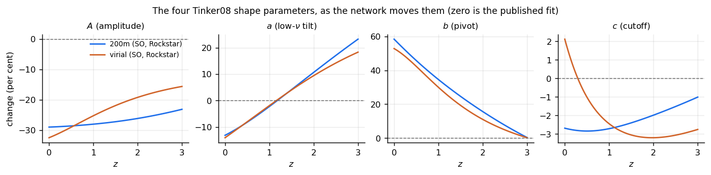
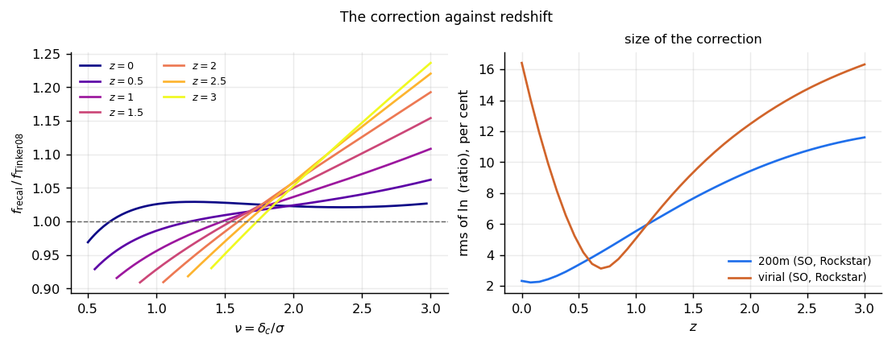
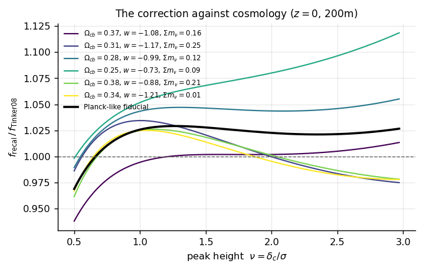

What is being learned
=====================

A correction to Tinker08's four shape parameters, as a function of cosmology
and redshift.

The form is unchanged
---------------------

.. math::

   f(\sigma) = A\left[\left(\frac{\sigma}{b}\right)^{-a} + 1\right]
               e^{-c/\sigma^{2}}

with the published :math:`\Delta_{\rm m} = 200` values and redshift evolution,
and each of the four multiplied by :math:`e^{g_i(\theta, z)}`, where :math:`g`
is a small tanh network of the eight cosmological parameters and redshift.

We fit the four parameters rather than four free functions of :math:`\sigma`
for three reasons.  At :math:`g = 0` the result is Tinker08 bit for bit, which
``tests/test_model.py`` asserts as equality rather than closeness.  The
peak-height dependence stays in the carrier, so the network expresses only the
difference between Tinker08 and the simulations.  And the fitted quantity keeps
Tinker08's named parameters, which separates a change in amplitude from a
change in tilt.

   The recalibration of each shape parameter against redshift.  Zero is the
   published fit.

The target is a ratio
---------------------

The CSST emulator ships its simulation-calibrated :math:`\dd n/\dd\ln M` and
its own Tinker08 evaluated against the cold spectrum at an explicit
:math:`\Delta`.  We fit their ratio,

.. math::

   R(M, z; \theta) = \frac{\dd n/\dd\ln M\ \big|_{\rm emulated}}
                          {\dd n/\dd\ln M\ \big|_{\rm Tinker08}}

which is a few per cent at :math:`z = 0`, so the functional form retains its
meaning.  :math:`R \to 1` at the calibration cosmology is then a statement the
tests can check.

The variance convention
-----------------------

:math:`\sigma(M)` is the cold field, baryons and cold dark matter with massive
neutrinos excluded, integrated against :math:`\bar\rho_{cb}` rather than
:math:`\bar\rho_m`.

A multiplicity function is meaningful only with the :math:`\sigma(M)` it was
fitted against.  Changing the convention evaluates :math:`f(\sigma)` at a
different :math:`\sigma` for the same halo, which shifts the abundance by more
than the correction being applied.  We therefore convert the emulator's
abundance into a multiplicity function in this convention at generation time,
so the fit absorbs the conversion once.

A :math:`\sigma(M)` built from the total-matter spectrum, or against
:math:`\bar\rho_m`, lies outside the convention the fit was made in, and the
package cannot detect it.

The correction grows with redshift
----------------------------------

   Measured on the shipped 200m weights: the rms of :math:`\ln R` over the
   fitted band runs 2.3, 5.6, 9.4 and 11.6 per cent at
   :math:`z = 0, 1, 2, 3`.

The few per cent quoted at :math:`z = 0` describes the correction at one
redshift, and :math:`g` depends on :math:`z` for that reason.

It moves with the cosmology
---------------------------

   The correction for six cosmologies drawn from the box.  A
   cosmology-independent correction would be a constant, which Tinker08's
   amplitude already carries.
