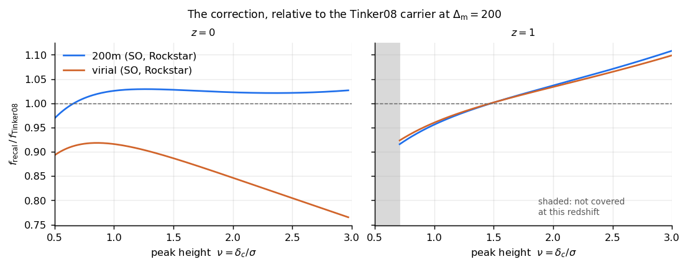

emu_hmf
=======

A differentiable, cosmology-dependent recalibration of the Tinker et al. (2008)
halo multiplicity function, trained against the CSST emulator over the box that
emulator was built on.

At a Planck cosmology Tinker08 is offset from the CSST suite by a few per cent
at :math:`z = 0`, and the offset varies with cosmology and redshift.  A fit
whose only inputs are :math:`\sigma(M)` and :math:`z` cannot express that
variation.  We fit a correction to Tinker08's own four shape parameters, which
returns Tinker08 exactly at zero correction.

.. code-block:: bash

   pip install emu_hmf

The inference path needs numpy and JAX.  ``jax.grad``, ``jax.jit`` and
``jax.vmap`` all pass through the cosmology.

   The two shipped corrections relative to Tinker08, at the Planck-like
   fiducial.  See :doc:`massdefs` for the two halo definitions.

.. toctree::
   :maxdepth: 2
   :caption: Using it

   installation
   quickstart
   tutorial

.. toctree::
   :maxdepth: 2
   :caption: What it is

   concepts
   massdefs
   validity

.. toctree::
   :maxdepth: 2
   :caption: Beyond the package

   halo_model
   reproducing
   testing
   citation

.. toctree::
   :maxdepth: 2
   :caption: API reference

   api/model
   api/box
   api/target
   api/generate
   api/fit

.. toctree::
   :maxdepth: 1
   :caption: Development

   changelog
