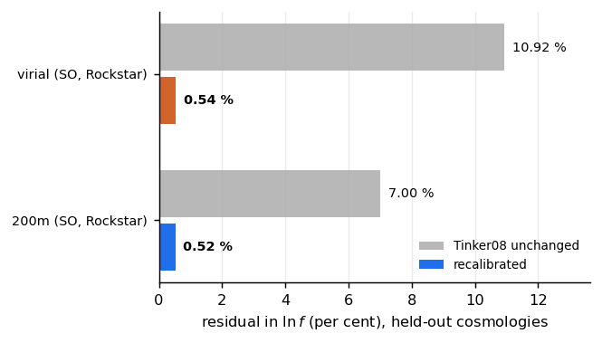

Two mass definitions, two files
===============================

We fit one correction per halo definition.  A correction fitted at one
definition and evaluated at another carries an error the size of the difference
between them.

.. code-block:: python

   from emu_hmf.model import HmfCorrection, WEIGHTS

   m200 = HmfCorrection(WEIGHTS["200m"])     # the default
   vir  = HmfCorrection(WEIGHTS["vir"])

What each one is
----------------

.. list-table::
   :header-rows: 1
   :widths: 14 30 18 18 20

   * - key
     - halo definition
     - Tinker08 unchanged
     - recalibrated
     - improvement
   * - ``"200m"``
     - SO, 200 × mean, Rockstar
     - 7.00 %
     - 0.52 %
     - 13.1 ×
   * - ``"vir"``
     - SO, virial, Rockstar
     - 10.92 %
     - 0.54 %
     - 19.1 ×

The figures are rms in :math:`\ln f`, measured on 200 cosmologies held out
entirely from training.  Both are read out of the weight files as ``val_rms``
and ``baseline_rms``, so they cannot drift from the weights they describe.

Both definitions are Rockstar spherical-overdensity masses, so the comparison
between the two corrections isolates the boundary from the halo finder.

Why not 200c
------------

The emulator offers a third definition, ``FoFM200c``, selectable in
:mod:`emu_hmf.target`.  It is a friends-of-friends mass, and a FoF catalogue
and a spherical-overdensity multiplicity function count different objects
rather than the same objects inside different radii.  We therefore fit at a
true SO mass, at the definition Tinker08 was calibrated in.  ``ggah_mod``
reaches :math:`200{\rm c}` afterwards through the published
:math:`\log\Delta` interpolation; this package carries no :math:`\Delta`
argument.

What the virial weights contain
-------------------------------

Both files correct the same carrier, :func:`emu_hmf.model.tinker08`, which is
Tinker08 at :math:`\Delta_{\rm m} = 200`.  The virial weights therefore absorb
the change of boundary as well as the recalibration.  At :math:`z = 0` they sit
14 per cent below the carrier on average across the covered band, ranging from
8 to 24 per cent with peak height, and the offset changes sign near
:math:`z \simeq 0.8` as :math:`\Delta_{\rm vir}(z)` falls toward the
Einstein--de Sitter value.

Against Tinker08-at-200m, the two files hold different quantities: at
``"200m"`` a recalibration, at ``"vir"`` a recalibration and a definition
change together.  Against their own targets both reach about half a per cent.

Do not mix them
---------------

Evaluating one file's correction for halos defined at the other boundary is
wrong by more than the residual either achieves, and by an amount comparable to
the offset they both correct.  Each ``.npz`` records its own ``massdef``, and
the training shards record theirs, so a fit cannot average two definitions:

.. code-block:: python

   >>> str(np.load(WEIGHTS["vir"])["massdef"])
   'RockstarMvir'
