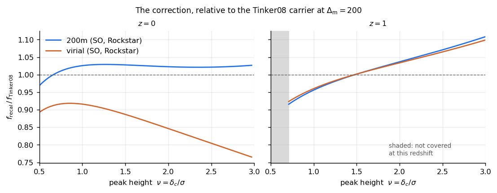
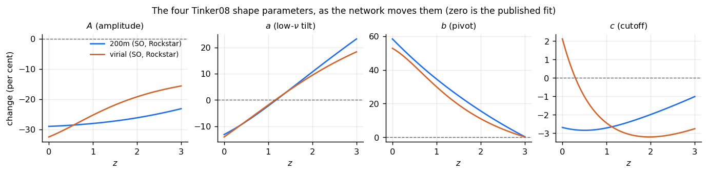
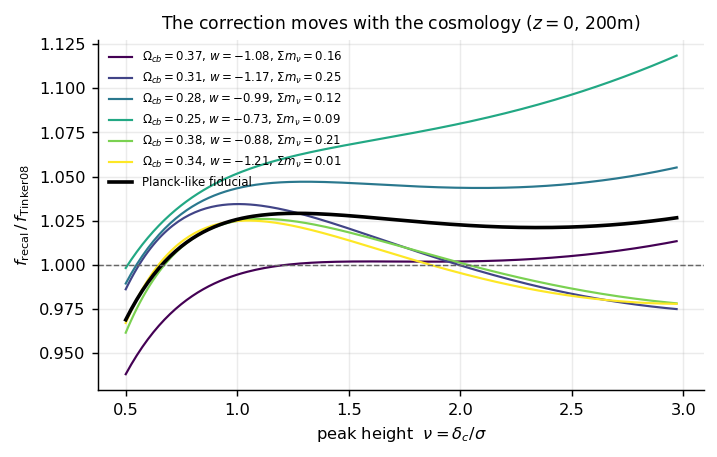
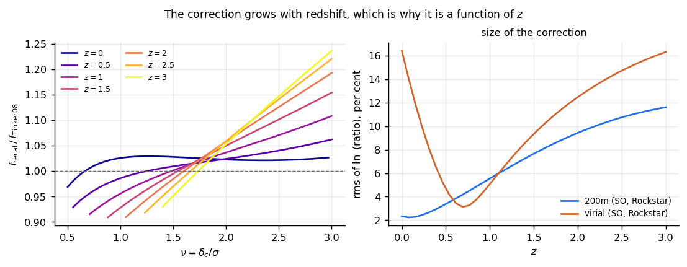
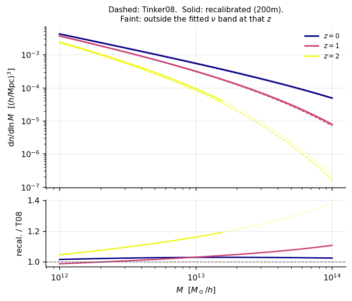
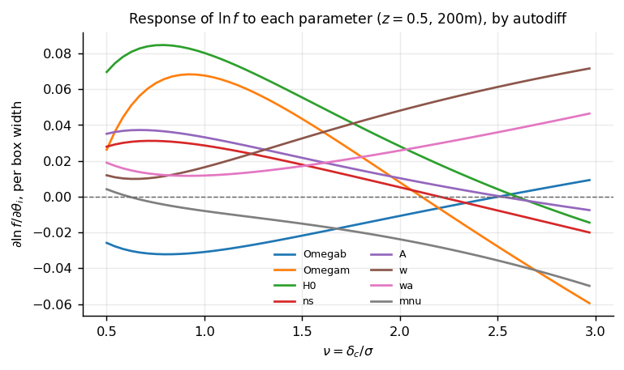
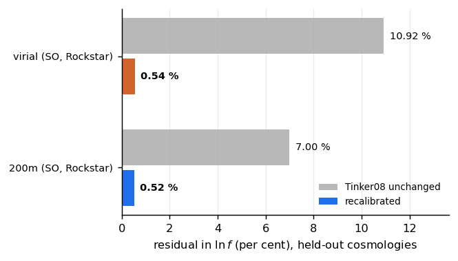

Tutorial
========

Every figure on this page is produced by ``docs/make_figures.py``, which needs
only the released package and matplotlib.  Run it yourself:

.. code-block:: bash

   python docs/make_figures.py

1. The correction, against the carrier
--------------------------------------

.. code-block:: python

   import numpy as np
   from emu_hmf import model, target

   z = 0.0
   nu = np.linspace(*target.nu_covered(z), 200)        # only what was fitted
   sigma = target.DELTA_C / nu

   base = np.asarray(model.tinker08(sigma, z))
   for key in ("200m", "vir"):
       corr = model.HmfCorrection(model.WEIGHTS[key])
       ratio = np.asarray(corr.fsigma(sigma, target.FIDUCIAL, z)) / base

At :math:`z = 0` the 200m correction is a couple of per cent and the virial one
is fourteen; by :math:`z = 1` they have converged and both are rising.  The
shaded strip is the part of the nominal :math:`\nu` band that the training set
does not reach at that redshift --- see :doc:`validity`.

2. What moved: the four shape parameters
-----------------------------------------

.. code-block:: python

   corr = model.HmfCorrection()
   z = np.linspace(0.0, 3.0, 120)
   g = np.asarray(corr.g(target.FIDUCIAL, z))          # (120, 4)
   percent = np.expm1(g) * 100.0                       # A, a, b, c

This is the answer a black box cannot give: the recalibration is mostly
amplitude and cutoff, and the two definitions disagree about the cutoff in a way
that grows with redshift.

3. The cosmology dependence
---------------------------

.. code-block:: python

   from emu_hmf import box
   for theta in box.sample(6, seed=11):                # six points in the box
       ratio = np.asarray(corr.fsigma(sigma, theta, 0.0)) / base

Spread of several per cent between cosmologies at fixed :math:`\nu`.  That
spread is the thing a constant offset cannot represent, and it is why the
correction takes :math:`\theta` at all.

4. Growth with redshift
-----------------------

Left: the ratio at seven redshifts.  Right: its size, as the rms of
:math:`\ln` ratio over the band covered at each :math:`z`.

The two definitions do not behave alike here, and the difference is the
boundary rather than the fit.  At 200m the correction grows monotonically, 2.3
per cent at :math:`z = 0` to 11.6 at :math:`z = 3` --- a factor of five.  At
virial it is **U-shaped**: 16 per cent at :math:`z = 0`, down to about 3 near
:math:`z = 0.7`, and back to 16 by :math:`z = 3`.  The dip is where
:math:`\Delta_{\rm vir}(z)` crosses :math:`\Delta_{\rm m} = 200` and the
change of boundary momentarily costs nothing, leaving only the recalibration.
See :doc:`massdefs`.

5. The mass function itself
---------------------------

.. code-block:: python

   n = corr.dndlnM(m, sigma, dlnsigma_dlnm, rho_cold, target.FIDUCIAL, z)

.. note::

   The :math:`\sigma(M)` behind this figure is **illustrative**: a small CLASS
   table cached in ``docs/data/sigma_illustrative.npz`` by
   ``docs/make_sigma_table.py``, in the cold-field convention the fit was made
   in.  The package itself has no power spectrum, and in use you supply your
   own --- see :doc:`concepts`.

   The faint continuations are outside the fitted :math:`\nu` band at that
   redshift.  At :math:`z = 2` a :math:`10^{14}\,M_\odot/h` halo is
   :math:`\nu = 4.3`, well past it.

6. Derivatives, which is the point
----------------------------------

.. code-block:: python

   import jax, jax.numpy as jnp

   def ln_f(theta, sigma, z):
       return jnp.log(corr.fsigma(sigma, theta, z))

   grad = jax.vmap(jax.grad(ln_f), in_axes=(None, 0, None))
   g = grad(jnp.asarray(target.FIDUCIAL), jnp.asarray(sigma), 0.5)

:math:`\partial \ln f / \partial \theta_i`, scaled by each parameter's box
width so the eight are comparable.  A flat line here would be a parameter the
mass function cannot constrain --- and a table lookup would give flat lines for
all eight.

7. How accurate is it
---------------------

.. code-block:: python

   w = model.load_weights(model.WEIGHTS["200m"])
   float(w["baseline_rms"]), float(w["val_rms"])       # 0.0677, 0.0052
   int(w["n_cosmologies"]), int(w["n_val_cosmologies"])

Read out of the weight files themselves, so the figure cannot drift from the
weights it describes.  The held-out set is 200 whole **cosmologies**, not
held-out rows: see :doc:`testing`.
