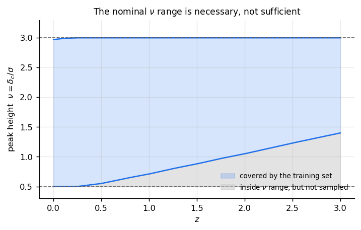

Where the correction is defined
===============================

Outside its domain this package refuses rather than extrapolating.  Half of the
domain is checked for you; the other half cannot be, and this page is about
both.

The cosmology: checked
----------------------

The eight parameters must be inside the CSST emulator's box.

.. list-table::
   :header-rows: 1
   :widths: 20 20 20 20 20

   * - :math:`\Omega_b`
     - :math:`\Omega_{cb}`
     - :math:`H_0`
     - :math:`n_s`
     - :math:`10^9 A_s`
   * - 0.04 – 0.06
     - 0.24 – 0.40
     - 60 – 80
     - 0.92 – 1.00
     - 1.7 – 2.5

.. list-table::
   :header-rows: 1
   :widths: 20 20 20

   * - :math:`w_0`
     - :math:`w_a`
     - :math:`\Sigma m_\nu` [eV]
   * - −1.3 – −0.7
     - −0.5 – 0.5
     - 0 – 0.3

Note :math:`\Omega_{cb}`: the box bounds the **cold** density, with massive
neutrinos excluded.

These numbers are copied into :mod:`emu_hmf.box` rather than imported, so that
a forecast does not have to install a Gaussian-process emulator to find out what
the bounds are --- and ``tests/test_box.py`` asserts the copy against the
emulator's own ``param_limits``, so it cannot drift without a test failing.

A cosmology outside the box raises, naming every offending parameter rather than
the first:

.. code-block:: python

   >>> emu_hmf.box.check({"H0": 55.0, "mnu": 0.4})
   ValueError: outside the CSST emulator's box, where this recalibration has no
   training data: H0 = 55 not in (60.0, 80.0); mnu = 0.4 not in (0.0, 0.3).
   The fit is not defined there and will not be extrapolated.

The peak height: not checked, and narrower than it looks
--------------------------------------------------------

The fit was made over :math:`\nu = \delta_c/\sigma \in [0.5, 3]`
(:data:`emu_hmf.target.NU_TRUSTED`) and over
:math:`M \in [10^{12}, 10^{14}]\,M_\odot/h`
(:data:`emu_hmf.target.M_TRUSTED`).

**Those two cuts do not commute with redshift.**  Growth pushes :math:`\sigma`
down, so a fixed mass is a higher peak later: the same
:math:`10^{12}\,M_\odot/h` that sits at :math:`\nu = 0.5` today sits at
:math:`\nu = 1.4` at :math:`z = 3`.  The low-:math:`\nu` half of the nominal
band is therefore simply *absent* from the training set above
:math:`z \simeq 0.25`.

   Grey: inside the nominal range, and never sampled.  A caller who checked only
   :data:`~emu_hmf.target.NU_TRUSTED` would be extrapolating there with no
   warning.

:func:`emu_hmf.target.nu_covered` records what the training set actually spans:

.. code-block:: python

   >>> from emu_hmf import target
   >>> target.nu_covered(0.0)
   (0.5, 2.97)
   >>> target.nu_covered(3.0)
   (1.4, 3.0)

This cannot be checked for you, because :math:`\sigma` reaches the package as a
number the caller computed --- from a spectrum ``emu_hmf`` never sees.  So it is
recorded, and it is yours to apply.

Why the cut is in peak height and not in mass
----------------------------------------------

Because :math:`\nu` unifies mass and redshift.  The same :math:`\nu = 3` is
:math:`10^{15}\,M_\odot/h` at :math:`z = 0` and :math:`3\times10^{13}` at
:math:`z = 2`, so a cut in mass alone would keep the exponential tail at high
redshift --- where a per-cent error in :math:`\sigma` is a tens-of-per-cent
error in :math:`f` --- and discard good signal at low redshift.

Why the upper mass limit is :math:`10^{14}`
--------------------------------------------

Measured, not chosen.  The residual of a cubic in :math:`\ln M` through the
target ratio at the Planck fiducial:

.. list-table::
   :header-rows: 1
   :widths: 40 40

   * - upper limit [:math:`M_\odot/h`]
     - residual
   * - :math:`10^{14}`
     - 4.2e-3
   * - :math:`10^{14.5}`
     - 1.4e-2
   * - :math:`10^{15}`
     - 3.0e-2
   * - :math:`10^{15.5}`
     - 4.0e-2

So the target is smooth to a few parts in a thousand up to
:math:`10^{14}\,M_\odot/h` and progressively rougher above it.  That is where a
simulation suite runs out of clusters, and a Gaussian process is noisiest where
its training data is thinnest --- so it is a property of the *target*, not of
any fit made to it.  A recalibration claimed to a per cent above that range
would be claiming to reproduce the emulator's own noise.

``tests/test_target.py`` checks both halves of that statement: smooth inside,
rough outside.  A range nobody checks becomes a number someone chose.

Redshift
--------

The emulator is trained at twelve redshifts from 0 to 3
(:data:`emu_hmf.target.Z_TRAINED`) and interpolates between them, so :math:`z`
is an input the recalibration gets nearly free.  Above :math:`z = 3` the
correction is undefined; Tinker08's own calibration stops at :math:`z = 2.5`,
so the upper end of the range is also roughly where the fit being corrected
stops meaning anything.
