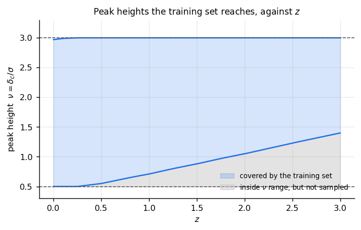

Where the correction is defined
===============================

Outside its domain this package refuses rather than extrapolating.  Half of the
domain is checked for you; the other half cannot be, and this page is about
both.

The cosmology: checked
----------------------

The eight parameters must be inside the CSST emulator's box.

.. list-table::
   :header-rows: 1
   :widths: 20 20 20 20 20

   * - :math:`\Omega_b`
     - :math:`\Omega_{cb}`
     - :math:`H_0`
     - :math:`n_s`
     - :math:`10^9 A_s`
   * - 0.04 – 0.06
     - 0.24 – 0.40
     - 60 – 80
     - 0.92 – 1.00
     - 1.7 – 2.5

.. list-table::
   :header-rows: 1
   :widths: 20 20 20

   * - :math:`w_0`
     - :math:`w_a`
     - :math:`\Sigma m_\nu` [eV]
   * - −1.3 – −0.7
     - −0.5 – 0.5
     - 0 – 0.3

Note :math:`\Omega_{cb}`: the box bounds the **cold** density, with massive
neutrinos excluded.

These numbers are copied into :mod:`emu_hmf.box` rather than imported, so that
a forecast does not have to install a Gaussian-process emulator to find out what
the bounds are --- and ``tests/test_box.py`` asserts the copy against the
emulator's own ``param_limits``, so it cannot drift without a test failing.

A cosmology outside the box raises, naming every offending parameter rather than
the first:

.. code-block:: python

   >>> emu_hmf.box.check({"H0": 55.0, "mnu": 0.4})
   ValueError: outside the CSST emulator's box, where this recalibration has no
   training data: H0 = 55 not in (60.0, 80.0); mnu = 0.4 not in (0.0, 0.3).
   The fit is not defined there and will not be extrapolated.

What the eight parameters cannot represent
------------------------------------------

The box above is CSSTemu's box, and a parameter that is not one of its axes has
no bound to be outside of.  Two reach a mass function anyway.

**Curvature.**  ``ggah_mod``'s :class:`Cosmology` carries :math:`\Omega_k`;
:data:`emu_hmf.box.PARAMS` does not, because the simulation suite this is
calibrated against is flat.  So ``check_box`` cannot see a curved cosmology, and
:func:`~emu_hmf.target.theta_from_cosmology` passes the same eight numbers it
would for a flat one.

**The neutrino ordering.**  The box bounds :math:`\Sigma m_\nu`, the *sum*.
``ggah_mod`` also carries ``nu_hierarchy``, which fixes how that sum divides
over three eigenstates.  The training set was generated with three equal masses.

Neither can be retrained away here.  ``emu_pk`` answered the same gap by fitting
a wider box against CLASS, which will solve a curved model on request; this box
belongs to a *simulation suite*, so closing it needs curved simulations rather
than a training run.

What can be done is to measure the cost, and the reason a measurement is
possible at all is the same design decision the rest of this package rests on:
:math:`\sigma(M)` is an **input**.  Curvature and the mass split reach a
multiplicity function through the variance and the growth history, and the
caller computes both with the full parametrisation.  What is left over is
whether the *correction* --- Tinker08's four shape parameters at fixed
:math:`(\sigma, z)` --- moves as well.

.. note::

   This measures the **carrier's** response, by restoring the
   :math:`\Omega_k(1+z)^2` term the emulator's own :math:`E(z)` already carries
   and re-evaluating its Castro+23 baseline at fixed :math:`\sigma`.  It does
   **not** measure the curvature response of the Gaussian-process residual,
   because there are no curved simulations to measure it against.  The claim is
   that the channel by which curvature reaches a multiplicity function at fixed
   :math:`\sigma` is the growth history through :math:`\Omega_m(z)`, that the
   target's own model is parameterised in exactly that, and that what remains
   has no separate curvature handle.  That is a stated assumption, not a
   measurement.

:data:`emu_hmf.target.OMEGA_K_COST` records the coefficient, as
:math:`\max|\Delta\ln f|` per unit :math:`|\Omega_k|`, and
:data:`~emu_hmf.target.NU_ORDERING_COST` records the ordering shift.  Both are
regenerated by ``docs/make_validity_bounds.py`` rather than typed.

.. list-table::
   :header-rows: 1
   :widths: 16 16 22 16 16

   * - weights
     - coefficient
     - residual at 0.002
     - crossover
     - ``tinker08``
   * - ``200m``
     - 0.2242
     - 0.00520
     - 0.301
     - 0.06766
   * - ``vir``
     - 0.8911
     - 0.00571
     - 0.116
     - 0.10368

The **crossover** is the column to read: the :math:`|\Omega_k|` at which the
induced error, added in quadrature to the held-out residual, reaches the
``tinker08`` this recalibration replaces.  Below it the correction is still the
better answer; above it the carrier is.

At the Planck and BAO bound of :math:`|\Omega_k| \le 0.002` the 200m correction
degrades from 0.00518 to 0.00520, against 0.06766 for ``tinker08`` unchanged.
So a curved cosmology is worth passing through rather than refusing, by a
factor of thirteen --- which is why this package does not refuse it.

**The two weights files are not equally sensitive.**  Virial is 3.97 times the
200m coefficient, so a single pooled number would understate it fourfold, and
its crossover at 0.116 is inside a range someone might actually sample where
200m's 0.301 is not.

The coefficient is measured to :math:`|\Omega_k| = 0.45` on both files
(:data:`~emu_hmf.target.OMEGA_K_MEASURED_TO`) and *falls* across that range, by
23 per cent at 200m and 15 at virial.  Every departure is in the same direction,
so reading it as linear overestimates the cost and puts the crossover early
rather than late.

**Both crossings are bracketed by the sweep**, so neither threshold rests on an
extrapolation.  :data:`~emu_hmf.target.OMEGA_K_MEASURED_CROSSING` holds the
observed crossing itself rather than a flag --- a flag says the crossover might
be off, a number says by how much --- and
:func:`~emu_hmf.target.crossover_is_measured` reports whether there is one.

.. list-table::
   :header-rows: 1
   :widths: 20 26 26 28

   * - weights
     - linear crossover
     - observed crossing
     - the law is early by
   * - ``200m``
     - 0.3009
     - 0.3715
     - 19 %
   * - ``vir``
     - 0.1162
     - 0.1210
     - 4 %

The law errs in the same direction on both, and by more where it reaches
further, which is what a falling coefficient should do.  Early costs a little
reach; late would recommend a correction already worse than the carrier it
replaces, while every number still looked reasonable.  That direction is
asserted at import in :mod:`emu_hmf.target` rather than left to inspection.

For the neutrino ordering the answer is the same and the margin is wider: the
shift peaks at :math:`1.15\times10^{-4}` at the 0.058993 eV floor, which is
2.2 per cent of the residual, and falls to :math:`1.2\times10^{-5}` at the box's
ceiling.  In quadrature the published 0.52 and 0.54 per cent do not move at
either figure they are quoted to.  A caller whose :math:`\sigma(M)` came from a
normal-ordered solve is *more* accurate than the training set, not less.

Like the peak-height range below, this cannot be checked for you --- a curved
cosmology is a perfectly ordinary object and only the caller knows the
:math:`\Omega_k` it was built with.  So it is recorded, and it is yours to
apply.

The peak height: not checked, and narrower than it looks
--------------------------------------------------------

The fit was made over :math:`\nu = \delta_c/\sigma \in [0.5, 3]`
(:data:`emu_hmf.target.NU_TRUSTED`) and over
:math:`M \in [10^{12}, 10^{14}]\,M_\odot/h`
(:data:`emu_hmf.target.M_TRUSTED`).

**Those two cuts do not commute with redshift.**  Growth pushes :math:`\sigma`
down, so a fixed mass is a higher peak later: the same
:math:`10^{12}\,M_\odot/h` that sits at :math:`\nu = 0.5` today sits at
:math:`\nu = 1.4` at :math:`z = 3`.  The low-:math:`\nu` half of the nominal
band is therefore simply *absent* from the training set above
:math:`z \simeq 0.25`.

   Grey: inside the nominal range, and never sampled.  A caller who checked only
   :data:`~emu_hmf.target.NU_TRUSTED` would be extrapolating there with no
   warning.

:func:`emu_hmf.target.nu_covered` records what the training set actually spans:

.. code-block:: python

   >>> from emu_hmf import target
   >>> target.nu_covered(0.0)
   (0.5, 2.97)
   >>> target.nu_covered(3.0)
   (1.4, 3.0)

This cannot be checked for you, because :math:`\sigma` reaches the package as a
number the caller computed --- from a spectrum ``emu_hmf`` never sees.  So it is
recorded, and it is yours to apply.

Why the cut is in peak height and not in mass
----------------------------------------------

Because :math:`\nu` unifies mass and redshift.  The same :math:`\nu = 3` is
:math:`10^{15}\,M_\odot/h` at :math:`z = 0` and :math:`3\times10^{13}` at
:math:`z = 2`, so a cut in mass alone would keep the exponential tail at high
redshift --- where a per-cent error in :math:`\sigma` is a tens-of-per-cent
error in :math:`f` --- and discard good signal at low redshift.

Why the upper mass limit is :math:`10^{14}`
--------------------------------------------

Measured, not chosen.  The residual of a cubic in :math:`\ln M` through the
target ratio at the Planck fiducial:

.. list-table::
   :header-rows: 1
   :widths: 40 40

   * - upper limit [:math:`M_\odot/h`]
     - residual
   * - :math:`10^{14}`
     - 4.2e-3
   * - :math:`10^{14.5}`
     - 1.4e-2
   * - :math:`10^{15}`
     - 3.0e-2
   * - :math:`10^{15.5}`
     - 4.0e-2

So the target is smooth to a few parts in a thousand up to
:math:`10^{14}\,M_\odot/h` and progressively rougher above it.  That is where a
simulation suite runs out of clusters, and a Gaussian process is noisiest where
its training data is thinnest --- so it is a property of the *target*, not of
any fit made to it.  A recalibration claimed to a per cent above that range
would be claiming to reproduce the emulator's own noise.

``tests/test_target.py`` checks both halves of that statement: smooth inside,
rough outside.  A range nobody checks becomes a number someone chose.

Redshift
--------

The emulator is trained at twelve redshifts from 0 to 3
(:data:`emu_hmf.target.Z_TRAINED`) and interpolates between them, so :math:`z`
is an input the recalibration gets nearly free.  Above :math:`z = 3` the
correction is undefined; Tinker08's own calibration stops at :math:`z = 2.5`,
so the upper end of the range is also roughly where the fit being corrected
stops meaning anything.
